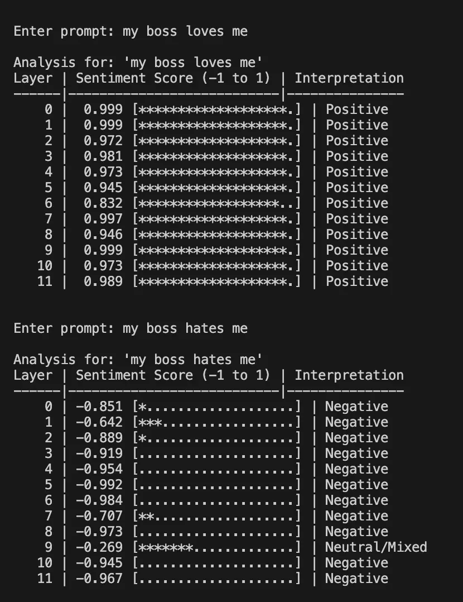
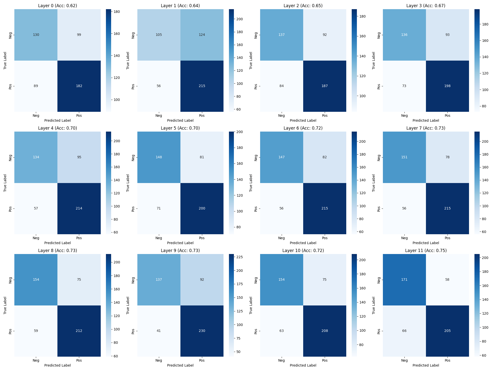
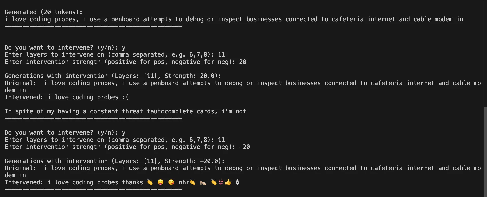

# transformer-lens-sentiment-attribution

# Introduction

Hello! I did a quick project over the weekend on some of the mech interp stuff we learned last week, in particular the intervening on activations with linear probe from Chapter 1.5 - OthelloGPT from the ARENA notebooks.

# Aim

Being inspired from induction heads and IOI, I wanted to interpret and manipulate the models understanding of sentiment.

### Training the probe

Unfortunately I didn't get to the end of the OthelloGPT before trying this project which meant I didn't realise that I needed to train my own probe (whoops). I ended up using this dataset from [Kaggle](https://www.kaggle.com/datasets/abhi8923shriv/sentiment-analysis-dataset?resource=download&select=train.csv), ~20k rows of selected text and labelled sentiment.

| text | selected_text | sentiment |
| :--- | :--- | :--- |
| I`d have responded, if I were going | I`d have responded, if I were going | neutral |
| Sooo SAD I will miss you here in San Diego!!! | Sooo SAD | negative |
| my boss is bullying me... | bullying me | negative |
| Journey!? Wow... u just became cooler. hehe... (is that possible!?) | Wow... u just became cooler. | positive |

Table: A small extract of the sentiment dataset.

I wasn’t sure which layer to intervene at so I didn’t to train on all of them, and determine which one was best.

<figure>
  
  <figcaption>Figure A: Small test to confirm probe could correctly identify some sentiment</figcaption>
</figure>

I was happy to see that it had some idea of sentiment but playing around with it, it kep giving various false postives which I decided to measure in the confusion matrix below:

<figure>
  
  <figcaption>Figure B: Confusion matrix of 12 probes trained for at each layer (12 layers of GPT-2-small). Tested on held-out dataset of ~2k rows</figcaption>
</figure>

Based from Figure B, I thought it was reasonable to intervene at the later layers of the model, particularly at layers 7 -> 11. 

## Intervening

For this, I used the `apply_scale` function from the OthelloGPT notebook, fetching the direction to flip along the probe’s direction $v$

$$
\text{resid} = \alpha v + \beta w
$$

$$
\text{resid} = -\,\text{scale}\,\alpha v + \beta w
$$

My idea was to flip in the opposite of the model’s current *thinking* of sentiment. Originally, it should receive an input prompt of some $x$ sentiment and continue on the text in that sentiment, whereas in the intervened case, the model should suddenly pivot to the opposite sentiment ($-x$), creating a very confusing text. 

<figure>
  
  <figcaption>Figure C: The probe getting mixed sentiment and then intervened to be more negative (flipped by -1)</figcaption>
</figure>

The flipping of the direction in done within `apply_scale` which made deciding intervention strength slightly confusing.

<figure>
  
  <figcaption>Figure D: Intervening twice. Initally with a intervention strength = 20 => -20 along the probe's direction of postive sentiment => 20x more negative. Then 20x more postive for the 2nd intervention. </figcaption>
</figure>

## What to do next + improve

**Measuring absolute sentiment of model post intervention**: I can’t use the probe to measure the effectiveness of the model’s changing of sentiment since I also used the probe’s measurement to apply the change.

**Missing obvious prompts**: I found that the probes weren’t that accurate and missed some easy obvious examples (e.g I am feeling happy/sad).

Wish me luck for our big ARBOx project! 😁